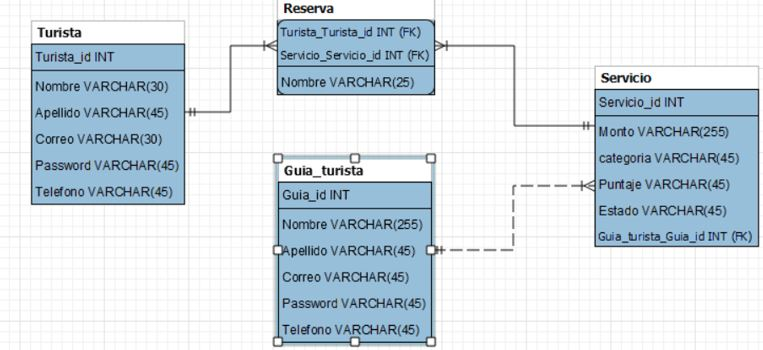

# Backend del Projecto TourIzi de la Asignatura Ingenieria de Software II

Grupo:

- Alonso Caceres (Jefe Backend)
- Jean Pieer Del Pozo (Jefe Frontend)
- Anthony Canon (Scrum Master)
- Angel Ferroa


## Instalacion

Clonar repositorio

```bash
  git clone https://github.com/AlonsoCGonzales/BackendSoftwareII
  cd BackendSoftwareII
```
Restaurar base de datos de Postgresql

```bash
  pg_restore -U postgres -d postgres scripts/data-backup.sql
```
Instalar dependencias con npm

```bash
  npm install
  npm install cors express sequelize react-router-doom
```
Diagrama de Clases


